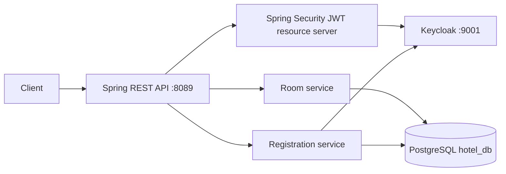

# Project Summary — Hotel Booking

## Purpose

A Spring Boot hotel API with room management, guest registration, Keycloak user provisioning, JWT authentication, and admin-only room creation/update. It contains a booking domain entity but does not yet implement booking endpoints or services.

## Architecture

Layered single-service architecture with PostgreSQL and external Keycloak identity management.

## Technologies

- Java 21, Spring Boot 3.5.16, Maven, Lombok
- Spring Web, Data JPA/Hibernate, Validation, Security, OAuth2 Resource Server
- PostgreSQL 17 and Docker Compose
- Keycloak; synchronous Keycloak Admin REST calls via `RestTemplate`

## Major Components and API Design

- `RoomController` exposes paginated room listing, room lookup, admin-only create/update, and a status patch.
- `RoomService` implements CRUD/search/status operations behind `RoomServiceInterface`; `RoomRepository` demonstrates derived queries and JPQL text-block search.
- `RegistrationController` provides public `POST /api/v1/auth/register`.
- `RegistrationService` checks local uniqueness, obtains a Keycloak client-credentials token, creates an identity, assigns `GUEST`, then persists the local `Guest`; it attempts a compensating Keycloak deletion if local persistence fails.
- `KeyCloakRoleConverter` maps Keycloak realm roles to Spring `ROLE_*` authorities.

## Database

Entities: `Room`, `Guest`, and `Booking`; enums model room type/status, booking status, and user role. `Booking` has many-to-one guest and room relations, but no repository/service/controller use was found. Constraints enforce unique room numbers, guest Keycloak IDs, email, and phone numbers. Pagination and typed `BigDecimal` nightly price are used. JPA uses `ddl-auto: update`; no migration files or explicit indexes for search/date availability were found.

## Authentication, Authorization, and Security

The service is a stateless OAuth2 resource server validating JWTs against the Keycloak issuer. Public access is deliberately granted to room GETs and registration. `@PreAuthorize("hasRole('ADMIN')")` protects create and update endpoints; the role converter reads Keycloak `realm_access.roles`.

The project contains secrets in `application.yaml`, including a Keycloak client secret, and default admin/DB credentials in Compose. These must be revoked if real and replaced with environment-specific secret management. No authorization checks link a guest token to a booking because booking workflows are absent.

## Logging, Testing, Deployment, and Missing Capabilities

Registration logs lifecycle/errors and handles a partial failure with compensating deletion. Compose provisions Keycloak and PostgreSQL, but does not build/run the Spring application as a container. Only a generated application context test exists. There is no API/security/integration test suite, CI/CD, caching, messaging, background scheduling, observability/tracing setup, frontend, AI, or LLM integration.

## Design and Programming Concepts

- Layered MVC, DTO pattern, Repository pattern, Service interface/implementation, dependency injection, global exception handling.
- OOP through encapsulated entities, enum domain modelling, interfaces, and JPA association composition.
- Validation, pagination, custom JPQL, transactions for read paths, REST, HTTP semantics, JWT, RBAC, external REST integration, and a manual compensating-transaction approach.

## Strengths

- Stronger security/authentication story than the monolithic gem backend.
- Registration thoughtfully maintains a local user-to-Keycloak ID link and attempts rollback after a failed DB save.
- Good room domain validation, uniqueness handling, pagination, search repository, and use of `BigDecimal`.

## Weaknesses and Interview Risks

- Booking is only an entity: no availability overlap query, reservation workflow, cancellation, payment, or concurrency control exists.
- `RoomController.updateRoom` lacks `@PathVariable` for `{Id}` and calls `createRoom` instead of `updateRoom`; it would create/fail rather than update. The patch status endpoint lacks `@PreAuthorize`, so any authenticated user can change room status.
- Keycloak Admin API calls use a manually constructed `RestTemplate`, raw `Map`, no configurable timeout/retry, and no durable outbox/reconciliation for cross-system failures.
- The room entity sets `createdAt` through both `@CreationTimestamp` and `@PrePersist`; use one source of truth.
- `ddl-auto: update`, plaintext secrets, minimal test coverage, and no migration/production deployment workflow remain substantial gaps.

## Interview Questions

1. Explain the difference between authentication and authorization in this API.
2. How are Keycloak realm roles converted to `hasRole('ADMIN')`?
3. Why cannot a database transaction guarantee both a Keycloak user and a Guest row?
4. How would you prevent two guests booking the same room for overlapping dates?
5. How would you build a production registration workflow with retries and reconciliation?
